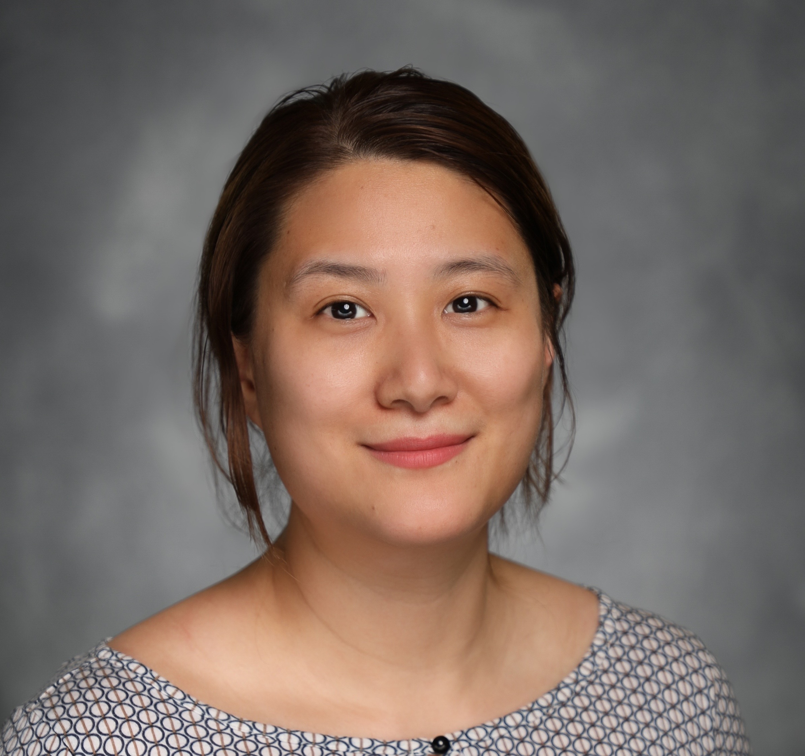

# Team

## Principal Investigator

I am an Associate Professor of Biostatistics and Bioinformatics, with a joint appointment with the Department of Mathematics at Duke University. I am affiliated with the Duke Center of Human Systems Immunology (CHSI),  Duke Cancer Institute (DCI),  and Duke Center of Statistical Genetics and Genomics. My research interest is to develop statistical and computational methods for complex omics and multi-omics data. My research sits at the intersection of Applied Mathematics, Bioinformatics, Biostatistics, Genetics and Genomics, and Machine Learning. I collaborate with many quantitative and biomedical investigators, with a wide spread of research topics in aging, cancer, immunology, neurosurgery, and pulmonary research.

Here is my [CV](./files/CV-JX-2023.pdf).

## Trainees

###  Postdocs
- [Carson Mosso](https://cmosso.github.io/)
- [Tuhin Mujumder](https://sites.google.com/view/tuhinmajumderstat/) (co-advise with Cliburn Chan)
- [Yuxia Xie](https://sites.google.com/view/yuxia-xie/)

### Ph.D. students
- Orlando Ferrer (Mathematics)
- Huiyue Li (Biostatistics)

### MB students
- Will Li (ECE)
- Finn Guo (ECE)

&nbsp;

## Alumni

### Ph.D. students

- Qi Gao - Current postdoc researcher at the University of Michigan
- Xuechan Li  — Currently at Novartis
- Jiyuan Fang  — Currently at Eli Lilly
- John Pura — Currently at Durham Department of Veterans Affairs
 
### MB students

Xiaohui Jiang, Yixuan Shao, Jintong Zhao, Xuanyin Zhao, Jilin Tian, Yaoyao Li, Yiren Shao, Aihua Li, Ruqian Cheng, Jenny Zhuo, Xiaodi Qin  

